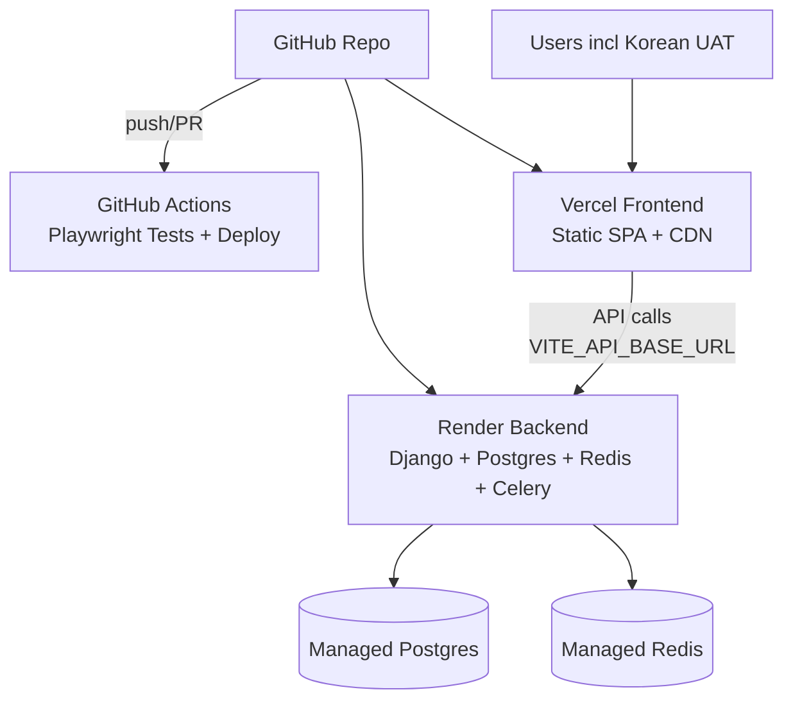

# CareBridge AI Web Deployment & Testing Strategy

**DHH-Aligned Hybrid Plan**: Vercel (Frontend) + Render (Backend + DB/Redis) + GitHub Actions (CI/CD + Playwright). Emphasizes velocity/simplicity (git-push deploys), minimal complexity, ship-fast like Heroku era, with lock-in/cost warnings.

## 1. Pros/Cons Analysis (vs Docker/Local)

### Docker/Local
**Pros**:
- Full control, portable, no lock-in/costs (VPS ~$5/mo).
- Matches current docker-compose.yml (Postgres/Redis/Django/Celery/React-Nginx).
- DHH fit: Self-hosted simplicity if scripted.

**Cons**:
- Manual VPS setup (Nginx/Gunicorn/PM2 per [`DEPLOYMENT_CONFIGURATION_GUIDE.md`](DEPLOYMENT_CONFIGURATION_GUIDE.md:131)).
- No auto-deploys/previews, scaling orchestration complex.
- UAT/testing: Local/Docker awkward for Korean users.
- Velocity low for iterations.

### Web Services
**Pros**:
- **Velocity**: Git push → auto-deploy/preview (Vercel/Render).
- **Simplicity**: Managed Postgres/Redis (Render), zero-config FE (Vite→Vercel).
- Playwright: GitHub Actions CI (existing [`playwright.config.ts`](frontend/playwright.config.ts)).
- Global CDN, staging/prod branches.
- DHH: Heroku-like "ship fast", foundation for MVP.

**Cons**:
- Costs: Vercel free hobby, Render $7/mo starter (DB/Redis extra ~$10), total ~$20/mo.
- Vendor lock-in: DB export needed for migration.
- Django PaaS tweaks (Procfile/Dockerfile.render.yaml).

**DHH Verdict**: Services win for MVP velocity/simplicity (avoid K8s complexity), monitor costs/lock-in, easy revert to Docker.

## 2. Decision Matrix

| Service          | Effort (1-5) | Value (Velocity) | Risk (Lock-in/Cost) | DHH Fit (Simple/Ship Fast) |
|------------------|--------------|------------------|---------------------|----------------------------|
| Vercel (FE)      | 1            | 5                | 1 ($0 hobby)        | 5                          |
| Render (BE+DB)   | 2            | 5                | 2 ($20/mo)          | 5                          |
| Railway (BE alt) | 2            | 4                | 2 ($20/mo)          | 4                          |
| GitHub Actions   | 1            | 5                | 1 (free)            | 5                          |
| Playwright Cloud | 3            | 4                | 2 ($10/mo)          | 3                          |

**Winner**: Vercel + Render + GitHub Actions (Effort 1.5, Value 5, Risk 1.5, DHH 5).

## 3. Recommended Hybrid Plan

**Architecture**:

- **FE**: Vercel (Vite/React perfect, proxy via env).
- **BE**: Render (Django support, managed DB/Redis/Celery).
- **Testing**: GitHub Actions (run Playwright on PRs).
- **Staging/Prod**: Branch deploys (main=prod, staging=staging).
- **UAT**: Vercel previews + Render staging URLs.

**Why Minimal/DHH-Aligned**:
- 3 services max, git-push velocity.
- No K8s/orchestration.
- Free tier viable MVP, scale later.

## 4. Migration Steps (Actionable for Code Mode)

1. **GitHub Setup**: `git init`, add remote, push (gitignore .env).
2. **Vercel FE**:
   - vercel.com → Import repo → Set `VITE_API_BASE_URL=https://carebridge-be.onrender.com/api`.
   - Build: npm run build (auto).
3. **Render BE**:
   - render.com → New Web (Python/Django) → Repo → Dockerfile from current.
   - Add Postgres/Redis services, promote prod DB.
   - Env vars: From .env.example + DB creds, SECRET_KEY, etc.
   - Build: `pip install -r requirements.txt; python manage.py migrate; python manage.py collectstatic`.
4. **GitHub Actions CI**:
   - `.github/workflows/ci.yml`: Checkout, npm ci (FE tests), docker-compose tests or Playwright.
5. **Config Updates**:
   - FE: vite.config.ts build proxy optional (use env).
   - BE: settings.py ALLOWED_HOSTS=*.vercel.app, CORS update.
6. **UAT/Verify**: Share staging URLs, run Korean tests.
7. **Monitor**: Render metrics, Vercel analytics.

**Costs**: ~$20/mo starter. **Time**: 2-4h setup.

**Risk Mitigation**: DB snapshots exportable, Docker fallback ready.

Approve/refine?